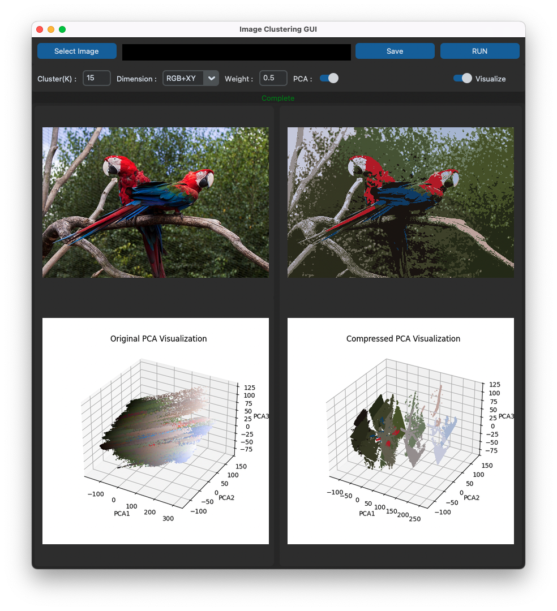

# KMeans-Image-Cluster



## 설명
이 프로그램은 학교 과제의 일환으로 Sklearn 라이브러리의 KMeans 모듈을 활용하여 제작된 이미지 클러스터링 도구입니다.
기본적으로 RGB 공간에서 클러스터링을 수행할 수 있으며, 거리 가중치를 고려하여 RGB+XY의 5차원 공간에서도 클러스터링을 실행할 수 있도록 설계되었습니다.
CustomTkinter를 사용하여 사용자 친화적인 GUI를 제공합니다.

## 설치
1. 환경 설정
- Python 3.12 (해당 버전에서 제작되었습니다)
- pip
2. 라이브러리 설치 및 실행
- 가상환경(venv)을 설정한 후 사용하는 것을 권장합니다.
- run.py 파일을 실행하여 프로그램을 실행합니다.
- run.py 실행 시 필요한 라이브러리를 자동으로 설치하도록 구현되어 있으나, 환경에 따라 올바르게 작동하지 않을 수 있습니다.
- 이 경우 아래 명령어를 통해 필요한 라이브러리를 수동으로 설치하세요.
```
pip install -r requirements.txt
```

## 사용법
1. 이미지 선택: Select Image 버튼을 클릭하여 이미지를 불러옵니다.
2. 클러스터 설정: Cluster 필드에 클러스터의 수(K > 0)를 입력합니다.
3. 차원 선택: 드롭다운에서 RGB 또는 RGB+XY를 선택합니다.
4. 실행: RUN 버튼을 클릭합니다.

## 추가 기능
- RGB+XY 클러스터링: 거리 가중치를 입력해야 합니다.
- PCA 스위치: RGB+XY 기반 클러스터링 시, PCA 기반 3차원 그래프와 RGB 기반 3차원 그래프를 전환하며 확인할 수 있습니다. (실행 후에도 가능)
- Visualize 스위치: 3차원 그래프의 표시 여부를 설정할 수 있습니다.
- Save 기능: 클러스터링된 이미지 및 그래프를 다운로드할 수 있습니다.
